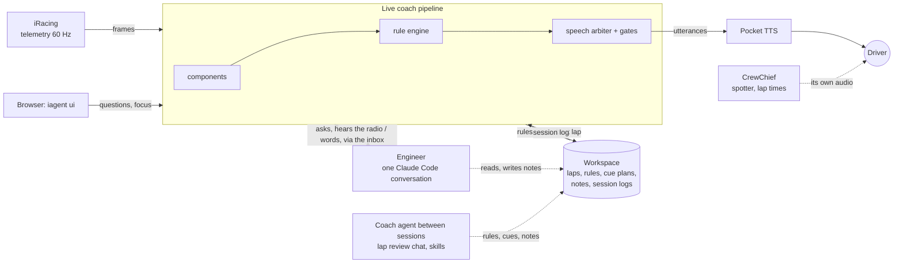
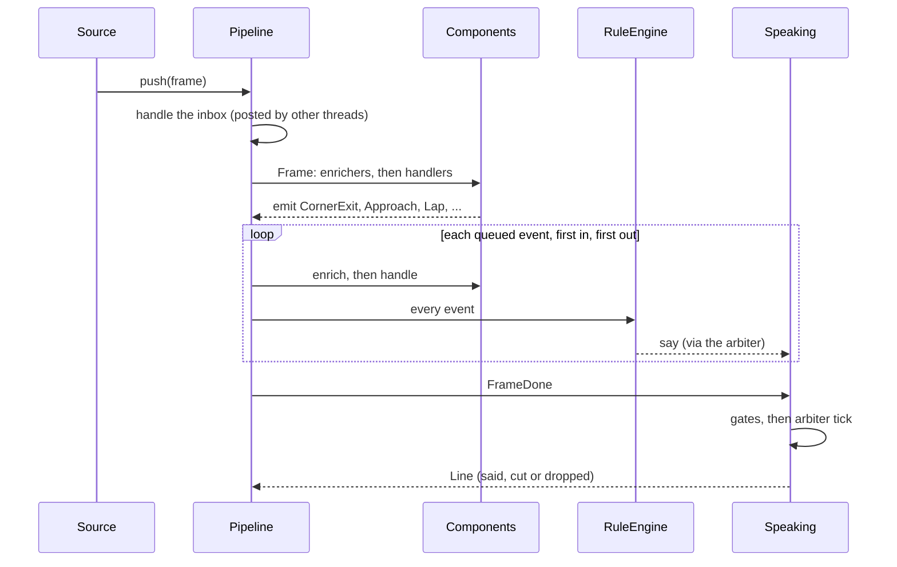
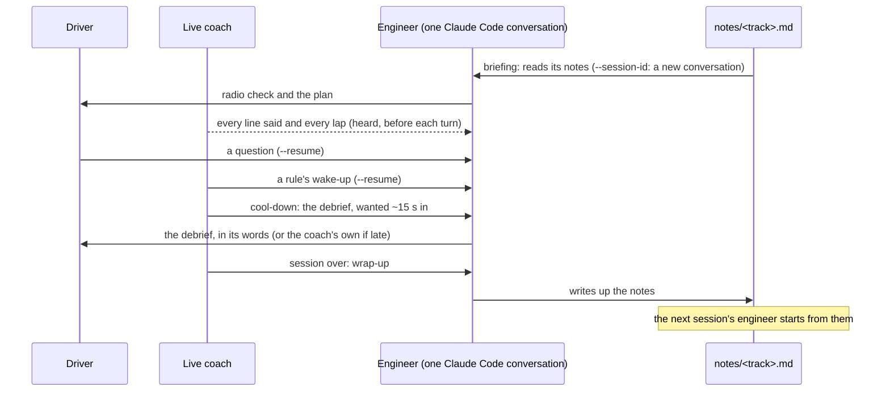

# Architecture

How the iRacing coach works, from a telemetry frame to a word in the driver's ear, and how to
extend it. For the goals, the data model, the analysis and the phasing, see the design notes in
[.claude/architecture.md](.claude/architecture.md); this document is how it's built.

## Contents

1. [The idea: a real race team](#1-the-idea-a-real-race-team)
2. [The system on the sim PC](#2-the-system-on-the-sim-pc)
3. [Code map](#3-code-map)
4. [The live pipeline](#4-the-live-pipeline)
5. [Rules: everything said goes through them](#5-rules-everything-said-goes-through-them)
6. [Speech](#6-speech)
7. [The engineer: one conversation per session](#7-the-engineer-one-conversation-per-session)
8. [Between sessions](#8-between-sessions)
9. [Extending it](#9-extending-it)
10. [Decisions, and what's next](#10-decisions-and-whats-next)

## 1. The idea: a real race team

The coach is built the way a real team works with a driver, and each role has one home in the
code:

| Role | Here | Model? | Job |
| --- | --- | --- | --- |
| Spotter | CrewChief | no | Cars alongside, lap times, gaps, fuel, flags. The coach stays out of its way. |
| Driving coach on the radio | the live pipeline and its built-in rules (`iagent/live/`) | no | Corner cues timed to the brake point, feedback after a corner, one focus, the lap summary. |
| Race engineer | the engineer: one Claude Code conversation per session (`iagent/live/engineer.py`) | yes | Radio check and plan, the driver's questions, rule wake-ups, the cool-down debrief, notes afterwards. |
| Data engineer | the coach agent between sessions: the lap review chat and the skills (`coach/skills/`) | yes | Lap review, picking the focus, writing and backtesting rules, rewriting cues. |
| Notebook | `workspace/notes/<track>.md` and the session logs | no | What carries from one session to the next. |

Two rules follow from that, and the rest of the design hangs on them:

- **No model in the 60 Hz loop.** Everything time-critical (cues, feedback, what to hold back) is
  deterministic and runs on every frame. The model is asked only where there's time for an
  answer, never waited on, and always has a fixed-text fallback.
- **Behaviour is definitions.** Events, components, rules, speech gates, causes of lost time and
  actions are each declared once; nothing in the core knows a particular one.

## 2. The system on the sim PC



Solid lines run every frame with no model; dotted ones involve the model and run off the
real-time path. A live session runs inside `iagent ui` (the Coaching tab) or `iagent live run`;
both build the same `LiveCoach` (`iagent/live/run.py`).

## 3. Code map

```text
iagent/
  agent.py            the agent harness: Agent (abstract), ClaudeCode (`claude -p`, one turn at a time)
  telemetry/          frames, session info, sources (.ibt replay; synthetic in testing/)
  laps/               segmentation, distance resampling, lap store, pace filter
  analysis/           corner map and metrics (shared with the live coach), comparisons, traces
  references/         Garage61, iRacing ghost files
  live/
    coach.py          LiveCoach: builds the pipeline; a small facade, no feature logic
    pipeline.py       Pipeline, Component (abstract), @on / @enrich
    events.py         every event, as a typed dataclass
    state.py          CoachState: the shared state, typed
    settings.py       Settings
    components/       laps, track, clock, pace, corners, positions, cue_caller, focus, history,
                      summary, debrief, speaking (and the speech gates)
    rules/            schema (the rule format), actions (Action subclasses), engine (RuleEngine)
    builtin_rules.py  the coach's own behaviour, as rules
    phrasing.py       every template; causes of lost time (Cause subclasses)
    expr.py           the small expression language rules are written in
    speech.py         the speech arbiter, utterances, voices
    narrator.py       Radio: the pipeline's link to the engineer
    engineer.py       Engineer: the session's conversation, its prompts
    rulebook.py       rules on disk, activation, backtests
    cues.py           cue plans (built per track and car)
    crewchief.py      sharing the radio with CrewChief
    session.py        live sessions run from the browser, and their logs
    report.py         a coached session, read back from its log
    run.py, sources.py, voice.py   wiring, iRacing and replay sources, Pocket TTS
  ui/                 `iagent ui`: the local API and the lap review chat
  cli.py              the `iagent` command
coach/skills/         the coach's skills (lap review, reference laps, live rules, ...)
web/                  the browser UI (React)
```

## 4. The live pipeline

### Events

Everything the live coach knows or does is an event, and every event is a typed dataclass in
[`iagent/live/events.py`](iagent/live/events.py). Its fields are its schema, each with a
description, so rules can use them and `iagent rules vars` lists them straight from the classes.

```python
@dataclass(kw_only=True)
class CornerExit(Event):
    """Just past a corner's exit, with its metrics against the reference lap."""
    name: ClassVar[str] = "corner_exit"      # how rules and the session log refer to it
    judged: ClassVar[bool] = True            # about driving: ignored while not pushing
    corner: int = doc("the corner", 0, corner=True)
    delta_s: float = doc("time lost (+) or gained (-) vs the reference", 0.0)
    ...
```

Class attributes say how an event is treated: `name` (for rules and the log), `log` (written to
the session log, which the review page reads) and `judged` (rules with `pushing_only` ignore it
while the driver isn't pushing). Inheritance is used where it's true: a counted `Lap` is a
`Crossing` that counted, and the engineer's replies (`CoachWords`, `DebriefWords`,
`NotesWritten`) share a `Reply` base.

| Group | Events |
| --- | --- |
| The pipeline | `Frame`, `FrameDone`, `SessionStart`, `SessionEnd`, `Clock` |
| The car | `Pit`, `PaceChanged`, `Slowing`, `CoolDown`, `Crossing`, `Lap` |
| Corners | `CornerExit`, `Advice` |
| Points on track | `Watch`, `Unwatch`, `Approach` |
| The focus | `FocusChanged`, `SetFocus` |
| Speech | `Line` (said, cut or dropped), `RuleFired` |
| The debrief | `DebriefLine`, `DebriefGiven` |
| From the driver and the browser | `Say`, `SetFocus`, `Narrate` (a question) |
| The engineer | `Narrate`, `NarrationAsked`, `Wake`, `CoachWords`, `DebriefWords`, `NotesWritten`, `Error` |

### Components

A component subclasses `Component` (abstract) and marks the methods for the events it handles.
An enricher adds to an event before anyone acts on it; a handler acts on it:

```python
class Summary(Component):
    @enrich(Lap)
    def words(self, e: Lap):
        e.summary_text = phrasing.summary(...)   # saying it is a rule's job
```

| Component | Handles | Adds to events, or keeps in the state | Emits |
| --- | --- | --- | --- |
| `Laps` | `Frame`, `Crossing` | lap, laps driven, line time, learning | `Crossing` (handled at once), `Lap` |
| `Track` | `Frame`, `Crossing` | on track, car alongside, lap clean | `Pit` |
| `Clock` | `Frame` | seconds since the start | `SessionStart`, `Clock` |
| `Pace` | `Frame`, `Crossing`, `Lap` | pushing or not, slow stretches, best lap; a lap's pace, new best | `PaceChanged`, `Slowing`, `CoolDown` |
| `Corners` | `Frame`, `Crossing`, `Lap` | a lap's corner results, its worst corner | `CornerExit` |
| `Positions` | `Watch`, `Unwatch`, `Frame` | when the next timed point is due | `Approach` |
| `CueCaller` | `Approach`, `Frame` | a cue's `wanted` and `text`; cues heard; in a corner | `Watch` (one per cue) |
| `Focus` | `SessionStart`, `SetFocus`, `Lap` | the focus; a lap's `focus_news` | `FocusChanged`, `Error` |
| `History` | `CornerExit`, `Crossing` | struggling corners, hints; a corner exit's `feedback` | `Advice` |
| `Summary` | `Lap` | a lap's `summary_text` | |
| `Debrief` | `Lap`, `PaceChanged`, `Slowing`, `CoolDown`, `DebriefWords`, `Frame` | debriefs given | `Narrate`, `DebriefLine`, `DebriefGiven` |
| `Radio` | `Narrate`, `Line`, `Lap`, `SessionStart`, `SessionEnd` | | `NarrationAsked`; posts the engineer's replies |
| `RuleEngine` | every event | | `Watch`, `RuleFired`, `Wake`, `Narrate`; speaks through the arbiter |
| `Speaking` | `FrameDone` | | `Line` |

Components decide *what's worth saying* and put it on events (`wanted` and `text` on a cue's
`Approach`, `feedback` on `CornerExit`, `summary_text` and `focus_news` on `Lap`); rules decide
*to say it*. Components share only the typed state, [`CoachState`](iagent/live/state.py), whose
fields every rule can read, and otherwise talk only through events.

### One frame



- **Order.** For each event every enricher runs, then every handler, in component order
  ([`components/__init__.py`](iagent/live/components/__init__.py)); the rule engine comes after
  all the components, `Speaking` last. Events emitted meanwhile are queued and handled first in,
  first out, so a replay at any speed makes the same decisions as the live session.
- **The one nested event.** A line crossing is handled at once (`dispatch`) inside the frame that
  crossed, so the frame that starts the new lap is counted in it.
- **Threads.** Only the coach's thread touches the pipeline. The browser and the engineer `post`
  events into a thread-safe inbox, handled at the next frame; nothing needs locks.

## 5. Rules: everything said goes through them

A rule is data: an event, an optional condition, actions and limits
([`iagent/live/rules/`](iagent/live/rules/)).

```json
{"id": "bus-stop-early-brake", "track": "spa-2024-up",
 "when": {"event": "corner_exit", "corner": 18},
 "if": "brake_diff_m < -10",
 "actions": [{"say": "{name}: braked {round5(-brake_diff_m)} metres early.", "priority": "feedback"}],
 "limits": {"cooldown_laps": 1}}
```

- **Strict, structured, never normalised.** The format is a JSON Schema generated from the event
  classes ([`rules/schema.py`](iagent/live/rules/schema.py), `iagent rules schema`): each event's
  `when` allows exactly its own fields, typed from the dataclass (a corner is an integer). Nothing
  turns "T9" or "turn 9" into 9: the writer (the agent) looks the number up in the corner map
  (`iagent corners list --json`), and a rule naming a corner the track doesn't have is rejected
  with the corners it does have. Errors name the field (`when.corner: 'T9' is not valid ...`).
- **`when`** names any event and filters on its fields (a value or a list; leave a field out for
  any) and an optional `where` condition. `approach` takes `at` (`{"corner": 9, "point": "apex"}`
  or `{"metres": 1830}`, with `lead_s`/`offset_m`, timed so a spoken line finishes before it);
  `frame` takes `edge` (a condition, edge-triggered with `for_s`/`rearm_s`).
- **Conditions and text** use a small expression language ([`expr.py`](iagent/live/expr.py)): a
  Python-syntax subset compiled to closures, no attribute access or arbitrary calls. A missing
  value makes a comparison false and keeps a line with that hole unsaid.
- **Actions** (a list) are subclasses of `Action` ([`rules/actions.py`](iagent/live/rules/actions.py)):
  `Say` (priority, a `long` version for when there's time, kind, expiry), `WakeEngineer` (the
  engineer is asked and may answer on the radio) and `Log`.
- **Limits**: `cooldown_s`, `cooldown_laps`, `max_per_lap`, `max_per_session`, `once`,
  `in_a_row`, and `pushing_only` (default) for judged events.
- **Groups.** The coach's own behaviour is the built-in rules
  ([`builtin_rules.py`](iagent/live/builtin_rules.py), group `coach`): the cue, the feedback, the
  lap summary, the focus news, the debrief, answers and the engineer's words. The agent's rules
  are group `agent`, which share a budget of six lines a lap and four seconds between lines.
- **Lifecycle.** `iagent rules add` checks a rule (fields, variables, corners) and saves it as a
  draft; `backtest` replays recorded sessions through the *same* `LiveCoach`, with the other
  active rules competing for the voice, and reports every firing and whether its line was said,
  cut or dropped, and why; `activate` needs a backtest of the rule as it is now. A running coach
  reloads rules when their files change.

## 6. Speech

The arbiter ([`speech.py`](iagent/live/speech.py)) owns the audio: one line at a time, the most
important first (cue, then feedback and answers, then the summary), nothing said once it has
expired (a corner cue is useless after the corner), and a corner cue cuts off anything less
urgent. A line may carry a longer version, said instead when the driver has time.

When not to speak is a list of gates ([`components/speaking.py`](iagent/live/components/speaking.py)),
each a condition over the shared state:

| Gate | When | Effect |
| --- | --- | --- |
| off track | not on track | hold; drop pending cues and feedback |
| car alongside | CrewChief's spotter is talking | hold |
| not pushing | out lap, cool-down, after a moment | longer versions allowed; drop pending cues as it starts |
| settling | just slowed down (maybe a moment) | hold |
| after the line | CrewChief reads the lap time | cues only |
| in a corner | between a cue's point and the corner's end | cues only |

## 7. The engineer: one conversation per session



- **One conversation** per live session, with a fixed id: `--session-id` on the first turn,
  `--resume` after. The session log records it, so the debrief written later on the review page
  continues the same conversation.
- **One turn at a time**, most important first; a request that's stale by its turn is dropped and
  the live coach says its own words instead:

  | Turn | Priority | Worth answering for |
  | --- | --- | --- |
  | the driver's question | 1 | 60 s |
  | the cool-down debrief | 2 | 20 s |
  | a rule's wake-up | 3 | 20 s (at most one every 30 s) |
  | the briefing | 4 | 90 s |
  | the wrap-up | 5 | 10 min |

- **Structured replies.** Each kind of turn (`TURNS` in `engineer.py`) asks for a reply in a JSON
  Schema (`claude -p --json-schema`): `{"say": "..." | null}` for words on the radio,
  `{"changed": "..."}` for the wrap-up. What's spoken is a field, and silence is `null`: no
  parsing of free text, no magic "SILENT" word.
- **It listens.** Each turn starts with what went out on the radio and the laps since its last
  turn, so it knows what the driver heard.
- **Isolated.** Its own conversation, the coach plugin, and only the tools the coach needs
  (`iagent`, reading and editing workspace files); nothing from the driver's other sessions.
- **Memory between sessions is the notebook**, not an ever-longer conversation: a new session
  starts a new conversation that reads the notes, which also keeps turns fast (about 5 s).
- **The harness is one adapter.** `Agent` ([`agent.py`](iagent/agent.py)) is abstract;
  `ClaudeCode` runs `claude -p`. Another harness is another subclass.

## 8. Between sessions

The coach agent (Claude Code with the `coach` plugin) works on the workspace through the
`iagent` CLI: it reviews laps (`lap-review`), compares against faster laps (`reference-laps`),
names corners (`name-corners`), writes and backtests rules (`live-rules`) and rewrites cues. The
lap review chat in the browser is the same agent, in its own conversation. Everything it changes
is a file in the workspace:

```text
workspace/
  laps/, index.sqlite            the driver's laps (raw 60 Hz and on a 1 m grid)
  reference/                     other drivers' laps (Garage61)
  tracks/<track>/corners.json    the corner map; cues/<car>.json the cue plan
  rules/<track>/<id>.json        rules (draft, active, archived) and their last backtest
  notes/<track>.md               the engineer's notebook
  sessions/live/<id>.jsonl       each coached session's log (every logged event)
```

## 9. Extending it

Each of these is a definition; nothing else changes.

**A new event.** A dataclass in `events.py` (or anywhere: subclassing registers it). It is
immediately usable in rules and listed by `iagent rules vars`.

```python
@dataclass(kw_only=True)
class KerbStrike(Event):
    """The car hit a kerb hard."""
    name: ClassVar[str] = "kerb_strike"
    judged: ClassVar[bool] = True
    jolt: float = doc("vertical acceleration (m/s²)", 0.0)
```

**A new detector.** A component that emits it, added to `COMPONENTS` (or passed to
`LiveCoach(components=...)`):

```python
class KerbDetector(Component):
    @on(Frame)
    def jolt(self, e: Frame):
        if (e.frame.get("VertAccel") or 0) > 20:
            self.emit(KerbStrike(jolt=e.frame.get("VertAccel")))
```

**A new behaviour.** A rule: the agent's (`iagent rules add`), or a built-in one in
`builtin_rules.py`:

```json
{"id": "kerbs", "when": {"event": "kerb_strike"}, "if": "jolt > 25",
 "actions": [{"say": "Easy on the kerbs."}], "limits": {"cooldown_laps": 2}}
```

**A new reason to keep quiet.** A `Gate` in `GATES`. **A new cause of lost time.** A `Cause`
subclass in `phrasing.CAUSES`. **A new action.** An `Action` subclass in `rules.actions.ACTIONS`.
**A new harness.** An `Agent` subclass.

`tests/live/test_pipeline.py` adds a detector, an event and a rule, and a gate, this way.

## 10. Decisions, and what's next

Agreed and built: no model in the 60 Hz loop; one event pipeline with typed events, behaviour as
definitions; everything said goes through rules; one engineer conversation per session, notes
across sessions; CrewChief as the spotter, the coach on technique.

Agreed, next, and where each fits:

- **Radio control.** A radio level in the state (full, focus only, critical only, silent) and how
  often the engineer may speak up, set by the engineer, overridden by the driver ("leave me
  alone", "talk to me") until the driver lifts it; every line gets an importance. It fits as
  driver command events, one field in `CoachState`, and one gate.
- **Push-to-talk.** Local speech-to-text posting the same `Narrate` question the Coaching tab does.
- **A standalone live service** on the sim PC owning the pipeline and the engineer, with the UI
  and CLI as its clients (today both build `LiveCoach` themselves through `run.py`).
- **Saved settings** in the workspace's `settings.json`, with per-run overrides.

Open: CrewChief pace notes for a "learning a new track" mode. They'd share CrewChief's audio queue,
but they're fixed recordings at fixed points, so they'd lose thinning, hints, short forms, timing
at the current speed, silence when not pushing, and rules' conditional cues. It needs testing on
the rig.
